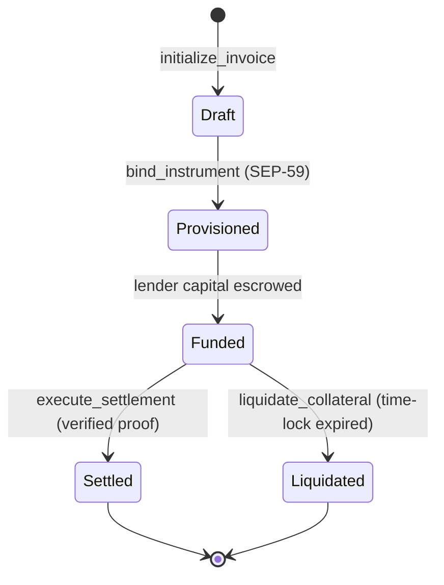

# Protocol Architecture

## The Smart Invoice

The **Smart Invoice (SI)** is a Soroban contract. It is not a token wrapper around
an off-chain record; it is the obligation itself, holding collateral and encoding
the conditions under which that collateral moves.

Each Smart Invoice owns four things:

| It holds | Purpose |
| --- | --- |
| **Terms** | Principal, settlement asset, due date, liquidation time-lock. |
| **Parties** | The business (a SEP-45 C-address), the lender (or vault), and the anchor authorised to attest payment. |
| **Collateral** | Assets escrowed against the facility, released only by settlement or liquidation. |
| **Instrument binding** | The SEP-59 `account_id` whose credits, and only whose credits, can settle this invoice. |

### Lifecycle



State transitions are one-way. There is no path from `Settled` back to `Funded`,
and no administrative override, so an incorrectly settled invoice is not reversible
by the protocol, which is why verification happens before execution rather than
after.

## The protocol interface

The contract surface is deliberately narrow. Three externally callable functions
carry the entire settlement lifecycle.

```rust
use soroban_sdk::{contracterror, Address, Bytes, Env, U256};

#[contracterror]
#[derive(Copy, Clone, Debug, Eq, PartialEq, PartialOrd, Ord)]
#[repr(u32)]
pub enum Error {
    InvoiceNotFound = 1,
    InvalidState = 2,
    ProofRejected = 3,
    NonceAlreadyUsed = 4,
    TimelockNotExpired = 5,
    Underpayment = 6,
    Unauthorized = 7,
}

pub trait MACHSettlementTrait {
    /// Provisions a new settlement account via SEP-59
    fn initialize_invoice(e: Env, business: Address, amount: i128, asset: Address) -> U256;

    /// The entry point for the MACH Oracle to settle the debt
    /// Requires verification of the Anchor-signed Proof-of-Payment
    fn execute_settlement(e: Env, invoice_id: U256, proof: Bytes) -> Result<(), Error>;

    /// Emergency fallback if the buyer fails to pay within the time-lock
    fn liquidate_collateral(e: Env, invoice_id: U256) -> Result<(), Error>;
}
```


`U256` and `Bytes` are `soroban_sdk` types, not Rust primitives. There is no
`u256` in Rust. `Error` is a `#[contracterror]` enum with an explicit `#[repr(u32)]`
discriminant, because Soroban serialises error codes as `u32` across the host
boundary.


### Storage types

```rust
use soroban_sdk::{contracttype, Address, BytesN, String, U256};

#[contracttype]
#[derive(Clone, Debug, Eq, PartialEq)]
pub enum InvoiceStatus {
    Draft,
    Provisioned,
    Funded,
    Settled,
    Liquidated,
}

#[contracttype]
#[derive(Clone, Debug)]
pub struct Invoice {
    pub id: U256,
    /// SEP-45 contract account. Signing policy lives inside it, not here.
    pub business: Address,
    pub lender: Address,
    /// Ed25519 public key from the anchor's stellar.toml SIGNING_KEY,
    /// pinned on-chain at provisioning time.
    pub anchor_signing_key: BytesN<32>,
    /// SEP-59 account_id. Only credits to this instrument can settle this invoice.
    pub instrument_id: String,
    pub amount_due: i128,
    pub settlement_asset: Address,
    pub collateral: i128,
    /// Ledger sequence after which liquidate_collateral becomes callable.
    pub liquidation_ledger: u32,
    pub status: InvoiceStatus,
}

#[contracttype]
pub enum DataKey {
    Invoice(U256),
    /// Consumed proof nonces. Presence means "already settled with this proof".
    Nonce(BytesN<32>),
    NextId,
    Config,
}
```

### The Proof-of-Payment envelope

The `proof: Bytes` argument is the anchor's notification carried verbatim. The
contract does not trust MACH's parsing of it; it re-derives everything.

```rust
#[contracttype]
#[derive(Clone, Debug)]
pub struct ProofOfPayment {
    /// The exact raw callback body the anchor signed. Re-serialising would
    /// change the bytes and invalidate the signature.
    pub raw_body: Bytes,
    /// Ed25519 signature over `timestamp . raw_body`.
    pub signature: BytesN<64>,
    pub timestamp: u64,
    /// SHA-256 of (invoice_id, instrument_id, transaction_id). Consumed once.
    pub nonce: BytesN<32>,
}
```

### On-chain verification

`execute_settlement` re-verifies rather than trusting the caller. This is what
reduces MACH from a trusted oracle to an untrusted relay.

```rust
fn execute_settlement(e: Env, invoice_id: U256, proof: Bytes) -> Result<(), Error> {
    let mut invoice: Invoice = read_invoice(&e, &invoice_id)?;
    if invoice.status != InvoiceStatus::Funded {
        return Err(Error::InvalidState);
    }

    let pop: ProofOfPayment = decode_proof(&e, &proof)?;

    // 1. The signature must verify against the key pinned at provisioning,
    //    not against a key supplied in the call, and not against whatever the
    //    anchor's TOML says today.
    e.crypto()
        .ed25519_verify(&invoice.anchor_signing_key, &signed_payload(&e, &pop), &pop.signature);

    // 2. One proof settles one invoice, exactly once.
    let nonce_key = DataKey::Nonce(pop.nonce.clone());
    if e.storage().persistent().has(&nonce_key) {
        return Err(Error::NonceAlreadyUsed);
    }

    // 3. The credit must be for this instrument, in this asset, for enough.
    let credit = parse_credit(&e, &pop.raw_body)?;
    if credit.instrument_id != invoice.instrument_id {
        return Err(Error::ProofRejected);
    }
    if credit.asset != invoice.settlement_asset {
        return Err(Error::ProofRejected);
    }
    if credit.amount < invoice.amount_due {
        return Err(Error::Underpayment);
    }

    // 4. Atomic settlement: nonce burned, collateral released, status advanced,
    //    all in one transaction or none of it.
    e.storage().persistent().set(&nonce_key, &true);
    release_collateral(&e, &invoice)?;
    invoice.status = InvoiceStatus::Settled;
    write_invoice(&e, &invoice);

    e.events().publish(
        (symbol_short!("mach"), symbol_short!("settled")),
        (invoice.id.clone(), credit.amount),
    );
    Ok(())
}
```

`ed25519_verify` is a host function that panics on failure, so an invalid
signature aborts the transaction and no state persists. The nonce is written
**before** collateral moves, so a re-entrant path cannot spend the same proof
twice.

### Events

| Event | Topics | Data |
| --- | --- | --- |
| `InvoiceCreated` | `("mach", "created")` | `(invoice_id, business, amount)` |
| `InstrumentBound` | `("mach", "bound")` | `(invoice_id, instrument_id)` |
| `SettlementExecuted` | `("mach", "settled")` | `(invoice_id, amount)` |
| `CollateralLiquidated` | `("mach", "liquidated")` | `(invoice_id, lender, amount)` |

Indexers reconstruct the full lifecycle of any facility from these four topics
without reading contract storage.

## Identity and key rotation

The invoice stores the business as a **SEP-45 contract account (C-address)**, not
as a classic keypair. The rationale is covered in
[The SEP Stack](sep-stack.md#sep-45-smart-contract-account-c-address-identity);
what matters at the contract level is how authorisation is expressed:

```rust
// The invoice stores the business's C-address, a contract and not a public key.
pub business: Address,

// Authorisation asks the account contract whether this call is permitted.
// The account decides how: one key, a quorum, a hardware signer, a policy
// contract. The invoice neither knows nor cares.
invoice.business.require_auth();
```

Because the address is a contract rather than a key, the business can rotate
signing keys while the invoice remains locked in the MACH settlement logic. Key
rotation is internal to the account contract and produces no state change in the
invoice: the collateral never moves, the instrument binding never changes, and
settlement remains callable throughout.

## What is pinned, and when

Every trusted input to `execute_settlement` is written on-chain **before** funds
are at risk. Nothing supplied at call time can redirect a settlement.

| Field | Pinned at | Supplied by |
| --- | --- | --- |
| `business` | `initialize_invoice` | Origination |
| `anchor_signing_key` | `bind_instrument` | SEP-1 lookup, operator-confirmed |
| `instrument_id` | `bind_instrument` | SEP-59 provisioning response |
| `settlement_asset`, `amount_due` | `initialize_invoice` | Origination |
| `lender` | Funding | SEP-56 vault or direct lender |
| `liquidation_ledger` | `initialize_invoice` | Terms |

The `proof` argument to `execute_settlement` is the only untrusted input, and it
is checked against all of the above before any state moves.

For how these fields map back to the standards that produce them, see
[The SEP Stack](sep-stack.md).
