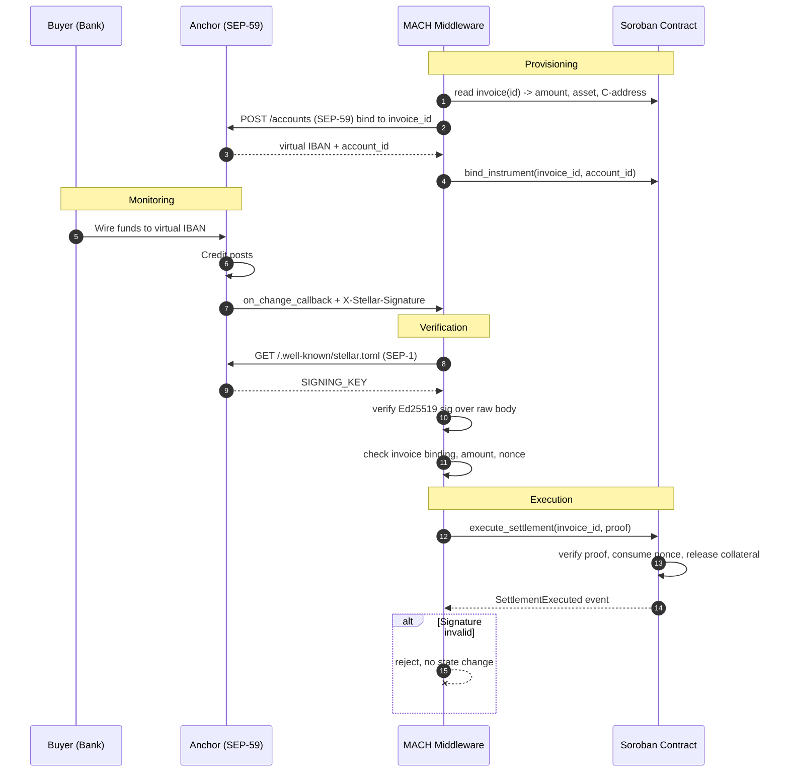

# The SEP-59 Oracle Workflow

This page specifies the complete path a payment takes from a buyer's bank to a
discharged invoice on Soroban. It is four steps: **Provisioning**, **Monitoring**,
**Verification**, and **Execution**.

## Sequence



---

## Step 1: Provisioning

MACH uses the anchor's `EXTERNAL_ACCOUNT_SERVER` (SEP-59) to request a unique
receiving instrument (a virtual IBAN, or the equivalent on a local rail) bound
to one specific Smart Invoice.

```http
POST /accounts HTTP/1.1
Host: anchor.example.com
Authorization: Bearer <SEP-10 / SEP-45 token>
Content-Type: application/json

{
  "asset": "iso4217:USD",
  "reference": "mach:invoice:0x8f3a…c41d",
  "callback_url": "https://oracle.mach.finance/v1/sep59/callback",
  "account_holder": {
    "type": "business",
    "identity": "CBQHNAX…7YKZ"
  }
}
```

```json
{
  "id": "acc_01HQ8…",
  "status": "active",
  "instructions": {
    "iban": "GB29 NWBK 6016 1331 9268 19",
    "bic": "NWBKGB2L",
    "beneficiary": "Anchor Ltd re: MACH 0x8f3a…c41d"
  }
}
```

The returned `account_id` is written back on-chain via `bind_instrument`, creating
a permanent, auditable link between a banking instrument and a contract.


**Why one account per invoice.** A credit to this account can only be a payment
against this invoice. There is no reference-field parsing, no amount-and-date
heuristic, and therefore no class of bug where a payment is matched to the wrong
obligation. The mapping is structural rather than inferred.


The business identity supplied here is a **SEP-45 contract account (C-address)**,
not a classic keypair. See [Protocol Architecture](architecture.md).

## Step 2: Monitoring

MACH listens for the anchor's `on_change_callback`. When the buyer's wire posts,
the anchor pushes a notification:

```http
POST /v1/sep59/callback HTTP/1.1
Host: oracle.mach.finance
Content-Type: application/json
X-Stellar-Signature: t=1735689600, s=MEUCIQ…base64…
X-Stellar-Domain: anchor.example.com

{
  "id": "acc_01HQ8…",
  "reference": "mach:invoice:0x8f3a…c41d",
  "status": "credited",
  "amount": "250000.00",
  "asset": "iso4217:USD",
  "transaction_id": "txn_01HQ9…",
  "credited_at": "2026-01-01T00:00:00Z"
}
```

The callback is push, not poll. There is no interval during which the payment has
settled but the protocol has not noticed.


At this point the payload is **untrusted input from an unauthenticated HTTP
request**. Nothing in it may influence state until Step 3 completes.


## Step 3: Verification

This is the load-bearing step, and the reason MACH is an oracle rather than a
webhook consumer.

MACH resolves the anchor's signing key from its `stellar.toml` (SEP-1) and
validates the `X-Stellar-Signature` header, proving the notification came directly
from the regulated anchor.

```
GET https://anchor.example.com/.well-known/stellar.toml
```

```toml
NETWORK_PASSPHRASE = "Public Global Stellar Network ; September 2015"
SIGNING_KEY        = "GCKFBEIYV2U22IO2BJ4KVJOIP7XPWQGQFKKWXR6DOSJBV7STMAQSMTGG"
EXTERNAL_ACCOUNT_SERVER = "https://anchor.example.com/sep59"
```

The verification routine, in order:

```ts
async function verifyNotification(req: Request): Promise<Proof> {
  // 1. Resolve the signing key for the domain that claims to have sent this.
  //    The domain is taken from our own anchor registry, never from the
  //    request, because a forged X-Stellar-Domain must not select its own key.
  const anchor = registry.mustResolve(req.headers["x-stellar-domain"]);
  const signingKey = await sep1.signingKey(anchor.tomlUrl);
  assert(signingKey === anchor.pinnedSigningKey, "SIGNING_KEY rotated unexpectedly");

  // 2. Verify Ed25519 over the exact raw body. Never over a re-serialised
  //    object: JSON round-tripping changes bytes and breaks the signature,
  //    or worse, validates a payload different from the one signed.
  const { t, s } = parseSignatureHeader(req.headers["x-stellar-signature"]);
  const payload = `${t}.${req.rawBody}`;
  assert(ed25519.verify(s, payload, signingKey), "bad signature");

  // 3. Reject stale signatures, bounding the replay window.
  assert(Math.abs(now() - t) < 300, "timestamp outside tolerance");

  // 4. Bind the payload to the invoice it claims to settle.
  const invoice = await soroban.getInvoice(parseReference(body.reference));
  assert(invoice.instrumentId === body.id, "instrument not bound to invoice");
  assert(invoice.anchor === anchor.address, "wrong anchor for invoice");

  // 5. Check economics before touching the chain.
  assert(body.status === "credited", "not a credit event");
  assert(BigInt(scale(body.amount)) >= invoice.amountDue, "underpayment");
  assert(body.asset === invoice.settlementAsset, "asset mismatch");

  return Proof.from(req.rawBody, s, t);
}
```

Each assertion closes a specific attack:

| Check | Attack it prevents |
| --- | --- |
| Key from a pinned registry, not the request header | Attacker points `X-Stellar-Domain` at a domain they control and supplies their own key. |
| Signature over the **raw** body | Signature validates against a re-serialised payload that differs from what was signed. |
| Timestamp tolerance | Indefinite replay of an old, genuinely signed notification. |
| Instrument-to-invoice binding | A real payment against invoice A used to settle invoice B. |
| Anchor-to-invoice binding | A legitimate but *different* anchor signing for an invoice it does not serve. |
| Amount and asset | Settling a $250,000 obligation with a $1 credit, or in the wrong currency. |


**Verification is fail-closed.** Any failed assertion terminates the request with
no state change and no retry against the unverified payload. There is no degraded
mode in which MACH settles on something it could not authenticate.


Note that this step is **stateless and reproducible**. Anyone holding the raw body,
the signature, and the anchor's published key can perform the identical check. The
middleware is not a trusted party; it is a convenience.

## Step 4: Execution

Once verified, MACH constructs a signed authorization entry and invokes
`execute_settlement` on the Soroban contract.

```ts
const proof = await verifyNotification(req);

const tx = await soroban
  .contract(MACH_SETTLEMENT_ID)
  .call("execute_settlement", invoiceId, proof.toBytes())
  .signAuthEntries({ signer: machRelayKey, validUntilLedger: currentLedger + 60 })
  .prepare();

await soroban.sendTransaction(tx); // idempotent: replay consumes no nonce twice
```

The contract re-verifies rather than trusting the relay, then settles atomically:

1. Recompute the notification digest and verify it against the anchor key stored
   **on-chain** for this invoice.
2. Consume the nonce, making the proof unusable a second time.
3. Release collateral to the lender, credit any surplus to the business, and mark
   the invoice `Settled`.
4. Emit `SettlementExecuted`.

All four occur in one transaction. There is no ledger close in which the invoice
is partially settled.


**Why the contract re-verifies.** If the contract trusted MACH's signature alone,
MACH would be able to forge settlements, and the trust model on the previous page
would be false. On-chain re-verification is what reduces MACH from a trusted
oracle to an untrusted relay: it can withhold a proof, but it cannot manufacture
one.


## Failure modes

| Failure | Behaviour | Recovery |
| --- | --- | --- |
| Signature invalid | Rejected at Step 3, logged, no state change. | None required; nothing happened. |
| Notification never arrives | Invoice remains `Funded` past its time-lock. | `liquidate_collateral` becomes callable. |
| MACH offline | Anchor retries per SEP-59 backoff; proofs remain valid within tolerance. | Replay the stored raw body once MACH recovers. |
| Duplicate callback | Nonce already consumed; contract rejects. | None required; settlement is idempotent. |
| Underpayment | Rejected at Step 3 amount check. | Invoice stays open pending the balance. |
| Anchor rotates `SIGNING_KEY` | Pinned-key assertion fails; requests reject. | Operator updates the registry after out-of-band confirmation. |

## End-to-end latency budget

| Stage | Typical |
| --- | --- |
| Credit posts → anchor callback | < 1s |
| SEP-1 key resolution (cached) | ~0ms |
| Signature verification | < 5ms |
| Invoice read + assertions | ~100ms |
| Soroban submission → ledger close | ~5s |
| **Total** | **~5 to 6s** |

Against a 72-hour manual baseline, this is the T+0 Settlement Finality claim in
concrete terms.
