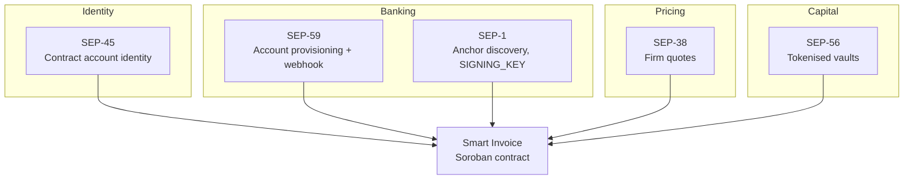
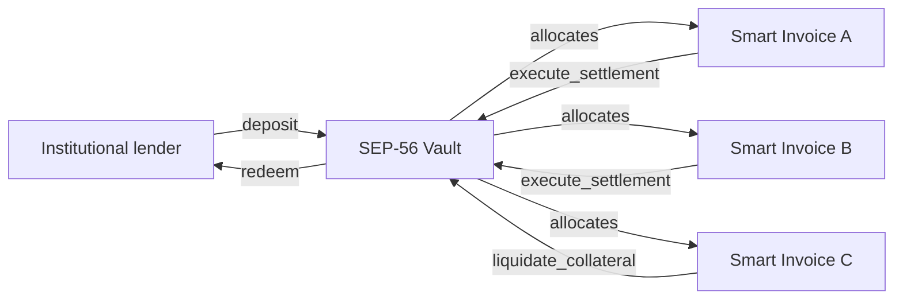

# The SEP Stack

MACH does not introduce a new interface for banks, lenders, or wallets. It
composes five Stellar Ecosystem Proposals into a single executable path from a
fiat credit to a contract state change.

This page is the reference for that composition: what each standard contributes,
what MACH actually calls, and what breaks if it is missing.

## Where each standard sits



## At a glance

| SEP | Name | Status | Role in MACH |
| --- | --- | --- | --- |
| **1** | Stellar TOML | Stable | Anchor discovery and `SIGNING_KEY` resolution |
| **38** | Anchor RFQ API | Stable | Firm quotes for cross-asset liquidity |
| **45** | Web Authentication for Contract Accounts | Draft | Smart contract account (C-address) identity |
| **56** | Tokenised Vault Interface | Proposed | Tokenised vaults for institutional lenders |
| **59** | External Account Server | Proposed | Virtual account provisioning and webhook oracle |


**Status labels are literal.** SEP-1 and SEP-38 are ratified and stable. SEP-45
is an accepted draft. SEP-59 and SEP-56 are proposals MACH is built against and
contributes to, and their surfaces may still change. Anything in this document
that depends on a proposed standard is marked as such.


---

## SEP-59: Virtual Account Provisioning and Webhook Oracle

**Status: Proposed.** The External Account Server proposal. This is the standard
MACH depends on most heavily, and the one that makes the whole design possible.

### What it contributes

SEP-59 does two things MACH cannot do without:

1. **Provisions a dedicated receiving instrument.** MACH asks the anchor's
   `EXTERNAL_ACCOUNT_SERVER` for a virtual IBAN (or the local-rail equivalent)
   bound to exactly one smart invoice.
2. **Pushes a signed payment notification.** When the credit posts, the anchor
   fires an `on_change_callback` carrying an `X-Stellar-Signature` header.

### Surface MACH integrates against

```
POST   {EXTERNAL_ACCOUNT_SERVER}/accounts     provision an instrument
GET    {EXTERNAL_ACCOUNT_SERVER}/accounts/:id read instrument status
                on_change_callback            anchor to MACH, signed
```

### Why one account per invoice

This is the load-bearing security decision, not an administrative detail.

With an omnibus account, matching a credit to an obligation is a heuristic over
reference fields, amounts, and timing. Heuristics produce false positives, and a
false positive here releases collateral against somebody else's payment. With one
account per invoice the mapping is **structural**: a credit to account *X* can
only be a payment against invoice *X*. There is no matching logic to get wrong,
and therefore none to attack.

### What breaks without it

Everything. Without provisioning there is no unambiguous payment mapping, and
without the signed callback there is no attributable payment event. MACH would be
reduced to polling an anchor API and trusting its own parsing.

---

## SEP-38: Firm Quotes for Cross-Asset Liquidity

**Status: Stable.** The Anchor RFQ API.

### What it contributes

Trade invoices are frequently denominated in one currency and settled in another.
SEP-38 supplies a **firm, time-bound quote** before settlement executes, so the
conversion rate is fixed at the moment the obligation is priced rather than at
the moment it clears.

### Surface MACH integrates against

```
GET    /prices        indicative rates across supported pairs
GET    /price         indicative rate for one pair
POST   /quote         firm quote, returns an id and an expiry
GET    /quote/:id     retrieve a firm quote
```

### Why a firm quote and not a spot rate

Between the anchor's notification and the contract's execution there is a
non-zero window (roughly five seconds, dominated by ledger close). A spot rate
read at either end of that window exposes the lender to slippage. A firm quote
removes the window from the risk calculation entirely: the rate is contractual,
the quote id is recorded against the invoice, and settlement either executes at
that rate or fails.

### What breaks without it

Single-currency settlement still works. Cross-asset settlement becomes
best-effort, with the lender absorbing whatever the rate does between
notification and execution.

---

## SEP-45: Smart Contract Account (C-Address) Identity

**Status: Draft.** Web Authentication for Contract Accounts.

### What it contributes

SEP-45 authenticates a business as a **contract account** (a C-address) rather
than as a classic keypair. Signing policy lives inside the account contract, so
the address is stable while the keys behind it are not.

### Surface MACH integrates against

```
Challenge/response authentication against a C-address
Signature policy evaluated by the account contract itself
Identity recorded on the invoice as `business: Address`
```

### Why this matters for a multi-month facility

A classic Stellar account *is* its keypair. Rotate the key and, from the ledger's
perspective, you are a different party.

That is unworkable for a business with a facility outstanding. Employees leave,
HSMs get replaced, and signing policy changes from a single signer to a 2-of-3
quorum as exposure grows. Under a classic-account model every one of those events
would require unwinding and reissuing the invoice: moving escrowed collateral,
renegotiating terms, and re-provisioning the banking instrument.


**The business can rotate keys while the invoice remains locked in the MACH
settlement logic.** The C-address is stable for the life of the facility. Key
rotation is an internal operation of the account contract and produces no state
change in the invoice at all.


This also composes with SEP-59: the provisioning request identifies the account
holder by C-address, so the anchor's KYC record binds to a durable identity
rather than to a key that will change.

### What breaks without it

Facilities become fragile against ordinary operational events. Any key rotation
during the life of an invoice forces a manual unwind.

---

## SEP-56: Tokenised Vaults for Institutional Lenders

**Status: Proposed.** The tokenised vault interface.

### What it contributes

Institutional capital does not fund invoices one at a time. SEP-56 standardises
the deposit and redemption surface a lender interacts with, so capital pooled
against a book of invoices is represented by a fungible claim with predictable
accounting.

### Surface MACH integrates against

```
deposit(assets, receiver)        capital in, shares out
redeem(shares, receiver, owner)  shares in, capital out
convert_to_assets(shares)        share price
convert_to_shares(assets)        inverse
total_assets()                   book value of the vault
```

### How it composes with settlement



The vault holds the lender position; the invoices hold the collateral. Because
settlement is atomic, vault accounting is exact at every ledger close. There is
no in-flight state where an invoice has been paid but the vault has not yet
recognised it.

### What breaks without it

Lenders fund invoices individually. That works, but it does not scale to
institutional book sizes and gives no standard redemption surface.

---

## SEP-1: Anchor Discovery

**Status: Stable.** The `stellar.toml` standard.

### What it contributes

SEP-1 is how MACH learns an anchor's `SIGNING_KEY`, which is the key every
payment notification is verified against. It is a small dependency with outsized
importance: it is the root of the entire trust model.

### Surface MACH integrates against

```toml
# https://anchor.example.com/.well-known/stellar.toml
NETWORK_PASSPHRASE      = "Public Global Stellar Network ; September 2015"
SIGNING_KEY             = "GCKFBEIYV2U22IO2BJ4KVJOIP7XPWQGQFKKWXR6DOSJBV7STMAQSMTGG"
EXTERNAL_ACCOUNT_SERVER = "https://anchor.example.com/sep59"
```


MACH resolves the key for a domain taken from its **own anchor registry**, never
from the incoming request, and asserts the resolved key matches the one pinned at
provisioning time. A forged `X-Stellar-Domain` header must not be able to select
its own signing key.


### What breaks without it

There is no way to know which key should have signed a notification, so there is
nothing to verify against and no trust model at all.

---

## Composition summary

Every trusted input to settlement is pinned on-chain before funds are at risk.
Nothing supplied at call time can redirect a settlement.

| Layer | Standard | Contract-visible artefact |
| --- | --- | --- |
| Identity | SEP-45 | `business: Address` (C-address) |
| Banking instrument | SEP-59 | `instrument_id: String` |
| Anchor discovery | SEP-1 | `anchor_signing_key: BytesN<32>` |
| Cross-asset pricing | SEP-38 | Quote id referenced at settlement |
| Lender capital | SEP-56 | `lender: Address` (vault contract) |

Next: [**The SEP-59 Oracle Workflow**](sep-59-oracle-workflow.md) traces a single
payment through all five.
